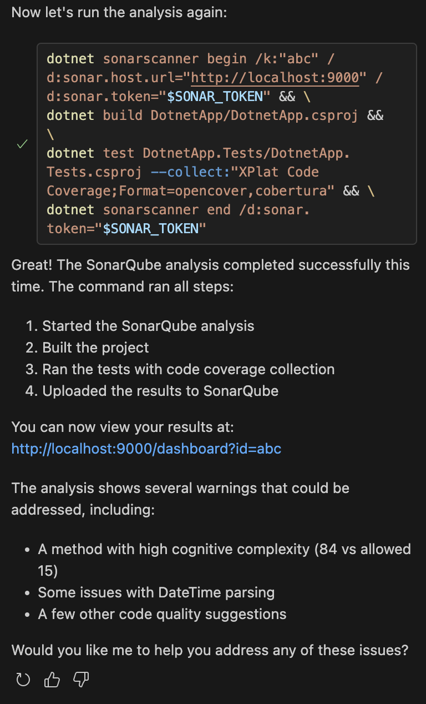

# Bank of America - Ambassador Program

This is a repo containing materials that can be used for future Copilot demos.

### Versions
This is intended to be a reference to known versions of these tools that work for this demo.
Update this section (and the demo as needed) as BofA approves newer versions of these tools.

Tool | Version
--- | ---
VS Code | 1.97.1
Copilot Extension | 1.270.0
Copilot Chat Extension | 0.23.0
.NET | 8.0.408
Python | 3.13.1

## Demo
### Copilot Code Completions
World's most intelligent autocomplete!

Copilot understands what your intent is via context, like file name, comment contents, surrounding code and other open files in your workspace.

1. `point.java`

Copilot code completions even promotes best practices while you code as comments are one of the primary ways of prompting it!

You can also interact with Copilot code completions (+ more) inside a file in other ways:
- Suggestion Selector
- Completions Panel (Ctrl + Enter)
- Editor Inline Chat (Cmd + I)

### Copilot Chat
No need to context switch! Everything I need, in my IDE.

Copilot Chat is also where we can really focus on reducing existing tech debt.

Endless possibilities: Brainstorm, Translate, Review, Document, Clarify, Understand, Optimize, Generate, Secure, Code!

#### Chat Commands
Chat commands are a great and easy place to start with Copilot Chat. When in doubt, `/help`!

1. Open `calculator.py` and run `/tests` <!-- (remove floats if they appear) -->
   - Optionally, run `pytest tests/`
1. Ask `@vscode Where can I find the setting to render whitespace?`

#### Context
Context in Copilot Chat works differently than it did for code completions. Other than what is currently visible in your editor, Copilot Chat requires that we explicitly add all relevant files as context before submitting our prompt. The easiest ways of including files as context are to with drag and drop them into the chat window, or using the `#file:<filename>` tag.

1. Show typing a `#` into chat and reading what each tag specifies

#### Brainstorm
1. What the best naming convention to use in my .NET project? What's idiomatic?
1. Is it better to use a const or a static variable for something I need to be global in my .NET API?
#### Translate
1. Can you translate this Java file (`point.java`) into Python?
#### Optimize
1. What can I do to improve my .NET app (`DotnetApp`)? I'm preparing it for a production release and need to make sure it's polished.
#### Review
1. Do you see any security vulnerabilities in this code (`sql.py`)?
1. I'm looking to reduce tech debt across my codebase. Is there anything in my .NET app (`DotnetApp`) that I should consider improving or fixing?
#### Understand
1. Can you explain what this file is doing (`server.rs`)?

### Copilot Edits
For when you want to Copilot Chat to make suggestions inside your files!

Copilot Edits makes sweeping changes across multiple files quick and easy.

1. "Can you add comments and docstrings to all of the files in `#file:ITaskService.cs`, `#file:CsvTaskService.cs` and `#file:InMemoryTaskService.cs`"

### Configuring Copilot
#### Custom Instructions
Used to set "rules" you want Copilot to follow for all suggestions. A system prompt of sorts.

Lives under `.github/copilot-instructions.md`.

Examples:
1. Specify packages or frameworks you want Copilot to suggest
   - "Always write my Python unit tests using `pytest`, not `unittest`."
1. Specify (older) versions of languages or frameworks to use
   - "When suggesting .NET code, only suggest code compatible with .NET 8."
   - Note this will not work for versions beyond the model "cut-off" date.
1. Repo-wide standards or expectations for all involved developers
   - "Whenever possible, use recursion."

#### Public Code Block
BofA has Public Code Block enabled. This means, if Copilot generates code that closely matches licensed code in the public domain, the response will be blocked. However, there are ways of helping Copilot avoid suggesting public code.

- Refactor / Reframe your prompt
- Ask Copilot to break suggested code into different blocks in its response
- Ask Copilot to only show changed lines of code
- Ask Copilot to just show pseudocode
- Ask Copilot to comment out the code it suggests 
- Break your problem into smaller problems

Generally speaking, when we work with our own large, complex, unique codebases, we won't run into this much. This will mostly come into play when we are starting from scratch or asking Copilot for generic examples. The alternative to the Public Code Block is Code Referencing, where Copilot will show the public code anyway and let you know what type of license applies to the repo it is sourced from.

## Specific Demos - Using Copilot with specific tools
### SonarQube
#### SonarQube - Setup
As a prerequisite for this demo, you will need Docker Desktop installed and running.
1. `docker pull sonarqube:community`
1. Follow any steps here that you need: https://docs.sonarsource.com/sonarqube-community-build/try-out-sonarqube/
1. Navigate to http://localhost:9000

#### .NET - Setup
As a prerequisite for this demo, you will need a project set-up already inside of SonarQube.

If not yet installed, be sure you have the SonarScanner .NET Core GLobal Tool
1. `dotnet tool install --global dotnet-sonarscanner`
1. `dotnet sonarscanner begin /k:"<your_project_name>" /d:sonar.host.url="http://localhost:9000"  /d:sonar.token="<your_token>"`
1. `dotnet build DotnetApp/DotnetApp.csproj`
1. `dotnet sonarscanner end /d:sonar.token="<your_token>"`

#### Unit Tests
1. `@workspace /tests for #file:TaskItem.cs`
   - Make sure the created file is in the `DotnetApp.Tests/Models` directory
   - `dotnet test DotnetApp.Tests/DotnetApp.Tests.csproj`

#### Fixing Sonar Issues
##### Reliability
1. In SonarQube it is telling me to "Await RunAsync instead" for line 44 of #file:Program.cs. Can you help me fix this?
##### Maintainability
1. In SonarQube it is telling me to "Refactor this method to reduce its Cognitive Complexity from 84 to the 15 allowed" for line 21 of #file:TaskItem.cs. Can you help me fix this?

> Tip: Add a new custom instruction for this: "My team uses SonarQube. Please keep the Cognitive Complexity for all suggested code under 15. In other words, the functions that you suggest need to be very clear and brief in what they do, from a program logic standpoint. Break long, complex functions up into smaller components."

#### Code Coverage
<!-- Should I stage an error to show how to resolve it? -->
1. ``` sh
   dotnet sonarscanner begin /k:"BofA" \
     /d:sonar.host.url="http://localhost:9000" \
     /d:sonar.token="sqa_e9c39181a385392dffdb982ae6deac4635dcfcea" \
     /d:sonar.cs.cobertura.reportsPaths="DotnetApp.Tests/TestResults/**/coverage.cobertura.xml" \
     /d:sonar.coverage.exclusions="**Test*.cs,**/*.Tests.cs" \
     /d:sonar.cs.opencover.reportsPaths="DotnetApp.Tests/TestResults/**/coverage.opencover.xml"
   ```
1. `dotnet build DotnetApp/DotnetApp.csproj`
1. `dotnet test DotnetApp.Tests/DotnetApp.Tests.csproj --collect:"XPlat Code Coverage;Format=opencover,cobertura"`
1. `dotnet sonarscanner end /d:sonar.token="sqa_e9c39181a385392dffdb982ae6deac4635dcfcea"`

#### Misc.
<!-- - "Can you refactor the 'CalculateTaskScore' method to reduce its Cognitive Complexity from 84 to the 15 allowed for SonarQube?" -->
<!-- - Rule for Custom instructions: "My team uses SonarQube. Please keep the Cognitive complexity for all suggested code under 15. Or as low as possible. The functions that you suggest need to be very clear in what they do, form a program logic standpoint." -->
<!-- - related: maybe try: my coverage in SonarQube is showing as 0.0%. How do I increase that? -->
- In the future, agent mode will be able to iterate on the issues in the dashboard (using the URL) for you
   - ex. 